# GDB调试模块所需的依赖配置
## 所需的全部依赖
> Nodejs环境
> 可以全局访问的gdb

## 模块的相关说明
### 运行操作系统环境
 目前仅可以在windows下环境运行。
 
### 需要注意的使用事项 
 本项目主要使用gdb的mi *（machine interface）* 模式，通过写gdb进程的stdin，读stdout与gdb进行交互。如果系统中存在干涉这一过程的程序，模块可能无法实现功能。
 
### 模块的gdb配置为全局访问
> 如果已有gdb，需要在环境变量配置中，将当前用户或者系统变量 *（本次相关说明以当前用户变量为例）* 中的Path，添加一条设置为gdb可执行应用程序 *（windows下为gdb.exe）* 所在目录的环境变量配置。
> 
> 如果没有gdb，在windows下需要在mingw官网下载gdb。

## gdb安装说明
> 如果有可用的gdb，请略过这部分内容，直接观看环境变量配置。如果同时已经配置了gdb全局环境变量，那么配置就已经完成了。

### gdb版本的相关问题
gdb有很多下载渠道以及很多版本，这里推荐使用7.6.1版本。
> 与推荐版本有所偏差大多数情况下不会产生问题，但过老或过新的版本可能使模块的某些功能失效。
### gdb下载方式
> mingw官网链接
> https://sourceforge.net/projects/mingw-w64/

gdb下载的一个推荐网址是mingw官网。我们打开网页，点击下方选项卡的files,然后往下拉，选择x86_64-posix-sjlj就行了。

> gdb资源压缩包直达链接
> https://sourceforge.net/projects/mingw-w64/files/Toolchains%20targetting%20Win64/Personal%20Builds/mingw-builds/8.1.0/threads-posix/sjlj/x86_64-8.1.0-release-posix-sjlj-rt_v6-rev0.7z

也可以直接点击这个链接，开始下载。
> minGW官网的file选项卡下的可供下载选项

    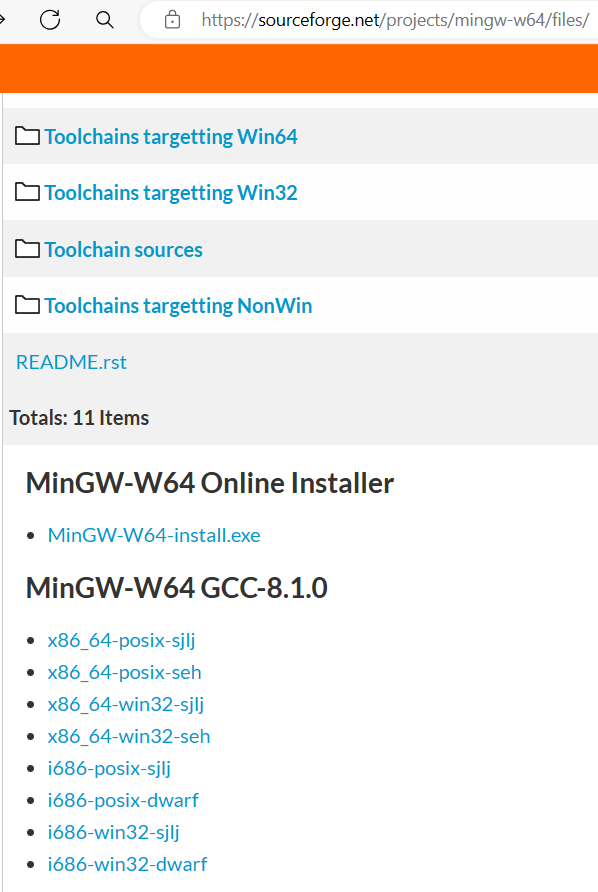

下载完成后，我们解压压缩包，一级一级目录点开。**/mingw64/bin** 中就有我们需要的gdb.exe。

    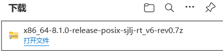

> 解压后的第一级目录

    

> 解压后的第二级目录

    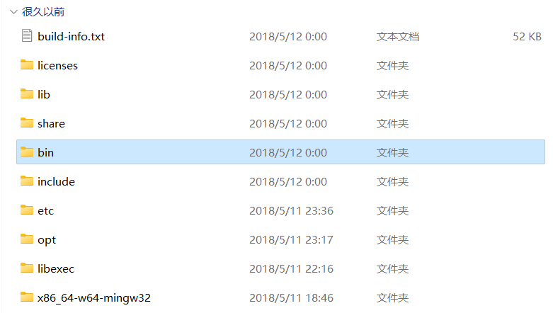

> 解压后的第三级目录，其中就有我们需要的gdb

    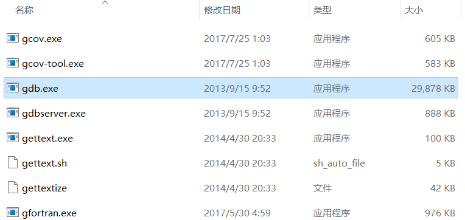

## gdb环境变量配置说明
> 下面开始说明如何配置环境变量。

### 打开环境变量配置页面
配置环境变量首先需要打开环境变量配置页面，在win10以及win11系列操作系统中，可以在开始菜单搜索栏中输入环境变量，点击显示的内容进入环境变量配置。

    

点击后，系统会弹出一个新窗口。在弹出的窗口中，点击环境变量，进入下一级页面。

    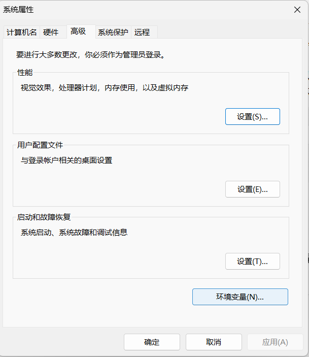

### 配置gdb全局环境变量
点击后，系统会弹出一个新窗口。在XXX的用户变量这一标题下的列表中，通过拉动右侧滚动条，或者滚动鼠标滚轮，我们可以找到列名为“变量”一栏中值为“Path”的一项，点击选中这一项，点击编辑按钮，进入用户的Path环境变量编辑。

    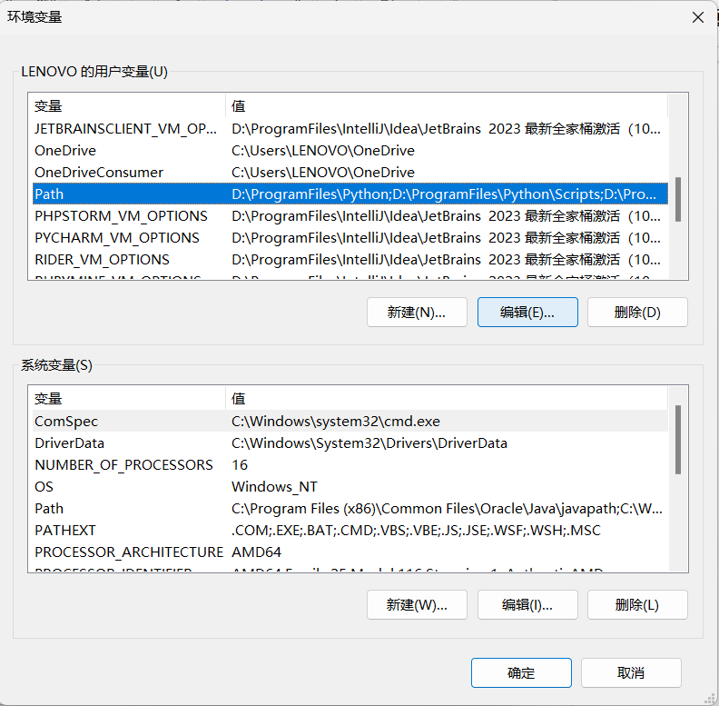

这一操作会弹出一个新窗口，我们检查一下新窗口中列出的环境变量中是否有gdb.exe所在的目录。若没有，点击空白行或者新建按钮，输入gdb.exe所在目录，点击确定保存结果。返回原先页面后，再次点击确定，完成编辑。然后关闭刚才打开的所有窗口即可。

    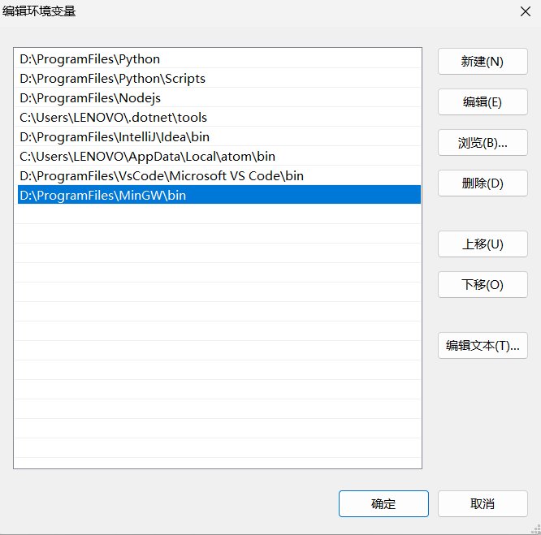

一般而言，新安装的gdb.exe位置为MINGW安装目录下的bin文件夹。
> mingw所在的目录中的bin文件夹

    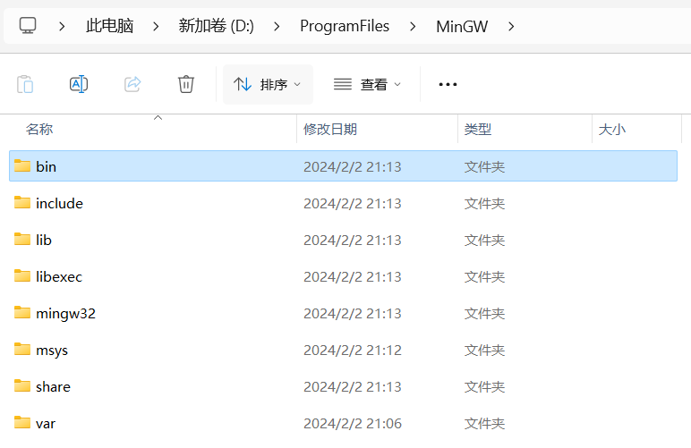

> bin文件夹中可以找到gdb,所以它是我们要配置的路径

    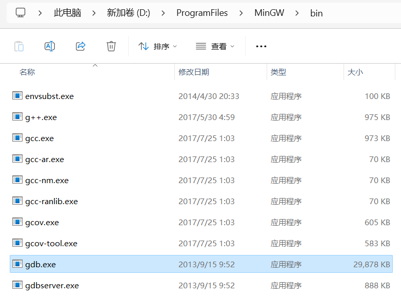

### 验证gdb环境变量配置是否成功
> 如果这个环节出现了差错，请重新检查是否进行了正确的gdb环境变量配置。

最后我们来验证一下gdb的环境变量配置是否成功。按下win *（window徽标）* +r键，在弹出的名为运行的窗口中输入cmd，点击确定，打开cmd应用程序。
> 打开cmd程序的方式

    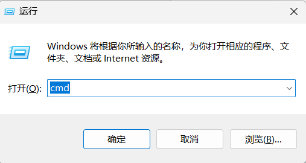

> cmd程序打开后的样子

    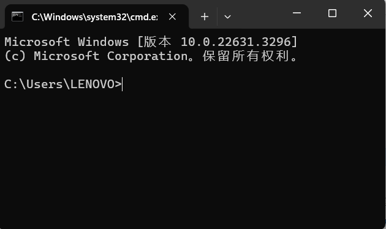

> 检验gdb全局访问是否配置成功

输入 **gdb -v** 然后点击回车，如果弹出了一大串版本信息，说明环境变量配置成功。
> gdb正常的版本信息应该类似这种

    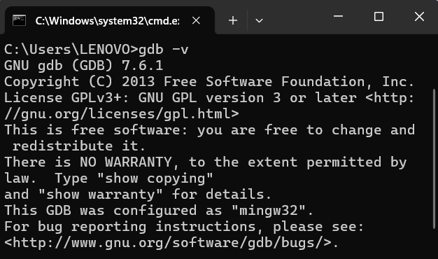

> 检验gdb mi 模式是否可用

输入 **gdb -i=mi** 然后回车，如果弹出了初始化信息，并且没有报错，说明gdb配置完成。
> gdb mi正常的启动信息应该类似这种

    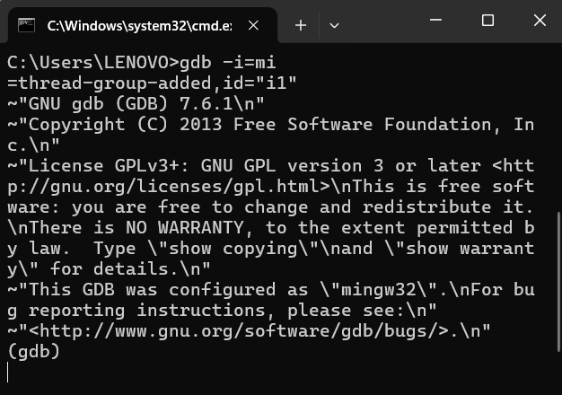

至此，模块所需的依赖配置完成。